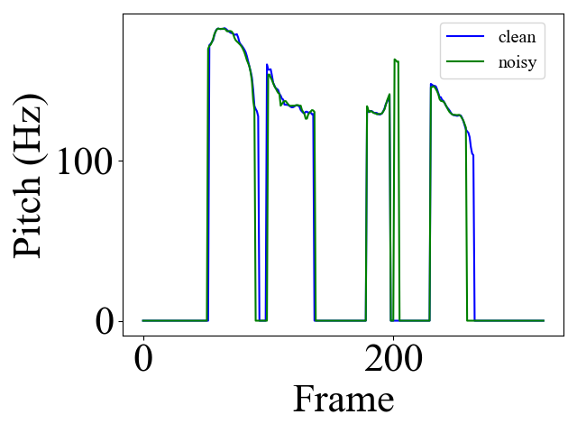

# 
 NCE-TTS: Noise-robust Cross-Speaker Emotion Transfer TTS through Knowledge Distillation and Orthogonal Constraint  

 Rui Liu,Member,IEEE1, Kailin Liang1, Tao Li 2, Dongchao Yang 3,Haizhou Li,Fellow,IEEE3
 

 1 Inner Mongolia University 

 2 Northwestern Polytechnical
University 

 3 Chinese University of Hong Kong

## Introduction
The cross-speaker emotion transfer (CSEF) in text-to-speech (TTS) synthesis task aims to synthesize speech for a target speaker with the emotion transferred from reference speech recorded by another (source) speaker. 
Traditional CSEF works adopted speaker-emotion decoupling strategies and achieved remarkable emotion transfer performance.
However, in scenarios where the reference speech is contaminated with noise, extracting clean emotion features and decoupling the speaker and emotion features becomes challenging, thereby leading to a decrease in the effectiveness of emotion transfer.
To address the above issues, we propose a novel Noise-robust Cross-Speaker Emotion Transfer TTS model, termed NCE-TTS.
NCE-TTS integrates the noise-robust emotion information extraction and noise-robust speaker-emotion disentanglement into a unified framework with two new modules, including 1) Knowledge Distillation; and 2) Orthogonal Constraint. 
The knowledge distillation aims to directly learn the emotion features of clean speech, from noisy speech, with a conditional diffusion model. The orthogonal constraint seeks to disentangle the deep emotion embedding and speaker embedding and further enhance the emotion-discriminative ability.
Unlike the traditional cascaded approach of first denoising and then extracting features, we have built a new training framework that achieves better emotion transfer results in noisy scenarios.
We conducted extensive experiments on a multi-speaker English emotional speech dataset ESD.
The objective and subjective results demonstrate that the proposed NCE-TTS can synthesize emotionally rich speech while preserving the target speaker's voice in various noisy scenarios, with a significant improvement compared to all advanced baselines.

## Overview
The overview of NCE-TTS as the following picture shows.

In the following, we will show some generated samples by our proposed method. 

## 1. Speaker Parallel Emotion Transfer on Various Noise Conditions.

In the following, we will demonstrate cases of Speaker Parallel Transfer. We have synthesized speech demonstrations under different emotion and noise conditions.

<!--
Speaker Reference Content: **I smell the breath of an English.**
Emotion Reference Content: **Then there was a report.**
-->

| 
  Content 
 | 
 Speaker reference 
 |
     Emotion reference    
 | 
 GenerSpeech 
| 
 Daft-Exprt 
| 
 NoreSpeech 
|
 Vall-E 
|
 NCE-TTS 
|
| :-----------------------:     |  :------: |  :-----------:     | :------: | :------: |:-------:|:------:|:------:|
| 
I smell the breath of an English.
|
&emsp; <audio class="audio-player2" src="parall/spk_ref/10.wav" controls preload></audio>
 |
Angry ,clean <audio class="audio-player2" src="parall/emo_ref/10.wav" controls preload></audio>
 |
&emsp;<audio class="audio-player2" src="parall/syn/10_generspeech-TTS-clean.wav" controls preload></audio>
|
&emsp;<audio class="audio-player2" src="parall/syn/10_daft-TTS-clean.wav" controls preload></audio>
|
&emsp;<audio class="audio-player2" src="parall/syn/10_norespeech-TTS-clean.wav" controls preload></audio>
|
&emsp;<audio class="audio-player2" src="parall/syn/10_valle-TTS-clean.wav" controls preload></audio>
|
&emsp;<audio class="audio-player2" src="parall/syn/10_NCE-TTS-clean.wav" controls preload></audio>
|
| 
I smell the breath of an English.
|
&emsp; <audio class="audio-player2" src="parall/spk_ref/10.wav" controls preload></audio>
 |
Angry ,0db <audio class="audio-player2" src="parall/emo_ref/10_0db.wav" controls preload></audio>
 |
&emsp;<audio class="audio-player2" src="parall/syn/10_generspeech-TTS-0db.wav" controls preload></audio>
|
&emsp;<audio class="audio-player2" src="parall/syn/10_daft-TTS-0db.wav" controls preload></audio>
|
&emsp;<audio class="audio-player2" src="parall/syn/10_norespeech-TTS-0db.wav" controls preload></audio>
|
&emsp;<audio class="audio-player2" src="parall/syn/10_valle-TTS-0db.wav" controls preload></audio>
|
&emsp;<audio class="audio-player2" src="parall/syn/10_NCE-TTS-0db.wav" controls preload></audio>
|
| 
I smell the breath of an English.
|
&emsp; <audio class="audio-player2" src="parall/spk_ref/10.wav" controls preload></audio>
 |
Angry ,5db <audio class="audio-player2" src="parall/emo_ref/10_5db.wav" controls preload></audio>
 |
&emsp;<audio class="audio-player2" src="parall/syn/10_generspeech-TTS-5db.wav" controls preload></audio>
|
&emsp;<audio class="audio-player2" src="parall/syn/10_daft-TTS-5db.wav" controls preload></audio>
|
&emsp;<audio class="audio-player2" src="parall/syn/10_norespeech-TTS-5db.wav" controls preload></audio>
|
&emsp;<audio class="audio-player2" src="parall/syn/10_valle-TTS-5db.wav" controls preload></audio>
|
&emsp;<audio class="audio-player2" src="parall/syn/10_NCE-TTS-5db.wav" controls preload></audio>
|
| 
I smell the breath of an English.
|
&emsp; <audio class="audio-player2" src="parall/spk_ref/10.wav" controls preload></audio>
 |
Angry ,10db <audio class="audio-player2" src="parall/emo_ref/10_10db.wav" controls preload></audio>
 |
&emsp;<audio class="audio-player2" src="parall/syn/10_generspeech-TTS-10db.wav" controls preload></audio>
|
&emsp;<audio class="audio-player2" src="parall/syn/10_daft-TTS-10db.wav" controls preload></audio>
|
&emsp;<audio class="audio-player2" src="parall/syn/10_norespeech-TTS-10db.wav" controls preload></audio>
|
&emsp;<audio class="audio-player2" src="parall/syn/10_valle-TTS-10db.wav" controls preload></audio>
|
&emsp;<audio class="audio-player2" src="parall/syn/10_NCE-TTS-10db.wav" controls preload></audio>
|
| 
I smell the breath of an English.
|
&emsp; <audio class="audio-player2" src="parall/spk_ref/10.wav" controls preload></audio>
 |
Angry ,0db-denoisy <audio class="audio-player2" src="parall/emo_ref/10_0db_enhanced.wav" controls preload></audio>
 |
&emsp;<audio class="audio-player2" src="parall/syn/10_generspeech-TTS-0db-denoisy.wav" controls preload></audio>
|
&emsp;<audio class="audio-player2" src="parall/syn/10_daft-TTS-0db-denoisy.wav" controls preload></audio>
|
&emsp;<audio class="audio-player2" src="parall/syn/10_norespeech-TTS-0db-denoisy.wav" controls preload></audio>
|
&emsp;<audio class="audio-player2" src="parall/syn/10_valle-TTS-0db-denoisy.wav" controls preload></audio>
|
&emsp;<audio class="audio-player2" src="parall/syn/10_NCE-TTS-0db-denoisy.wav" controls preload></audio>
|
| 
I smell the breath of an English.
|
&emsp; <audio class="audio-player2" src="parall/spk_ref/10.wav" controls preload></audio>
 |
Angry ,5db-denoisy <audio class="audio-player2" src="parall/emo_ref/10_5db_enhanced.wav" controls preload></audio>
 |
&emsp;<audio class="audio-player2" src="parall/syn/10_generspeech-TTS-5db-denoisy.wav" controls preload></audio>
|
&emsp;<audio class="audio-player2" src="parall/syn/10_daft-TTS-5db-denoisy.wav" controls preload></audio>
|
&emsp;<audio class="audio-player2" src="parall/syn/10_norespeech-TTS-5db-denoisy.wav" controls preload></audio>
|
&emsp;<audio class="audio-player2" src="parall/syn/10_valle-TTS-5db-denoisy.wav" controls preload></audio>
|
&emsp;<audio class="audio-player2" src="parall/syn/10_NCE-TTS-5db-denoisy.wav" controls preload></audio>
|
| 
I smell the breath of an English.
|
&emsp; <audio class="audio-player2" src="parall/spk_ref/10.wav" controls preload></audio>
 |
Angry ,10db-denoisy <audio class="audio-player2" src="parall/emo_ref/10_10db_enhanced.wav" controls preload></audio>
 |
&emsp;<audio class="audio-player2" src="parall/syn/10_generspeech-TTS-10db-denoisy.wav" controls preload></audio>
|
&emsp;<audio class="audio-player2" src="parall/syn/10_daft-TTS-10db-denoisy.wav" controls preload></audio>
|
&emsp;<audio class="audio-player2" src="parall/syn/10_norespeech-TTS-10db-denoisy.wav" controls preload></audio>
|
&emsp;<audio class="audio-player2" src="parall/syn/10_valle-TTS-10db-denoisy.wav" controls preload></audio>
|
&emsp;<audio class="audio-player2" src="parall/syn/10_NCE-TTS-10db-denoisy.wav" controls preload></audio>
|
{: .table1_2}

| 
  Content 
 | 
 Speaker reference 
 |
     Emotion reference    
 | 
 GenerSpeech 
| 
 Daft-Exprt 
| 
 NoreSpeech 
|
 Vall-E 
|
 NCE-TTS 
|
| :-----------------------:     |  :------: |  :-----------:     | :------: | :------: |:-------:|:------:|:------:|
| 
I smell the breath of an English.
|
&emsp; <audio class="audio-player2" src="parall/spk_ref/30.wav" controls preload></audio>
 |
Happy ,clean <audio class="audio-player2" src="parall/emo_ref/30.wav" controls preload></audio>
 |
&emsp;<audio class="audio-player2" src="parall/syn/30_generspeech-TTS-clean.wav" controls preload></audio>
|
&emsp;<audio class="audio-player2" src="parall/syn/30_daft-TTS-clean.wav" controls preload></audio>
|
&emsp;<audio class="audio-player2" src="parall/syn/30_norespeech-TTS-clean.wav" controls preload></audio>
|
&emsp;<audio class="audio-player2" src="parall/syn/30_valle-TTS-clean.wav" controls preload></audio>
|
&emsp;<audio class="audio-player2" src="parall/syn/30_NCE-TTS-clean.wav" controls preload></audio>
|
| 
I smell the breath of an English.
|
&emsp; <audio class="audio-player2" src="parall/spk_ref/30.wav" controls preload></audio>
 |
Happy ,0db <audio class="audio-player2" src="parall/emo_ref/30_0db.wav" controls preload></audio>
 |
&emsp;<audio class="audio-player2" src="parall/syn/30_generspeech-TTS-0db.wav" controls preload></audio>
|
&emsp;<audio class="audio-player2" src="parall/syn/30_daft-TTS-0db.wav" controls preload></audio>
|
&emsp;<audio class="audio-player2" src="parall/syn/30_norespeech-TTS-0db.wav" controls preload></audio>
|
&emsp;<audio class="audio-player2" src="parall/syn/30_valle-TTS-0db.wav" controls preload></audio>
|
&emsp;<audio class="audio-player2" src="parall/syn/30_NCE-TTS-0db.wav" controls preload></audio>
|
| 
I smell the breath of an English.
|
&emsp; <audio class="audio-player2" src="parall/spk_ref/30.wav" controls preload></audio>
 |
Happy ,5db <audio class="audio-player2" src="parall/emo_ref/30_5db.wav" controls preload></audio>
 |
&emsp;<audio class="audio-player2" src="parall/syn/30_generspeech-TTS-5db.wav" controls preload></audio>
|
&emsp;<audio class="audio-player2" src="parall/syn/30_daft-TTS-5db.wav" controls preload></audio>
|
&emsp;<audio class="audio-player2" src="parall/syn/30_norespeech-TTS-5db.wav" controls preload></audio>
|
&emsp;<audio class="audio-player2" src="parall/syn/30_valle-TTS-5db.wav" controls preload></audio>
|
&emsp;<audio class="audio-player2" src="parall/syn/30_NCE-TTS-5db.wav" controls preload></audio>
|
| 
I smell the breath of an English.
|
&emsp; <audio class="audio-player2" src="parall/spk_ref/30.wav" controls preload></audio>
 |
Happy ,10db <audio class="audio-player2" src="parall/emo_ref/30_10db.wav" controls preload></audio>
 |
&emsp;<audio class="audio-player2" src="parall/syn/30_generspeech-TTS-10db.wav" controls preload></audio>
|
&emsp;<audio class="audio-player2" src="parall/syn/30_daft-TTS-10db.wav" controls preload></audio>
|
&emsp;<audio class="audio-player2" src="parall/syn/30_norespeech-TTS-10db.wav" controls preload></audio>
|
&emsp;<audio class="audio-player2" src="parall/syn/30_valle-TTS-10db.wav" controls preload></audio>
|
&emsp;<audio class="audio-player2" src="parall/syn/30_NCE-TTS-10db.wav" controls preload></audio>
|
| 
I smell the breath of an English.
|
&emsp; <audio class="audio-player2" src="parall/spk_ref/30.wav" controls preload></audio>
 |
Happy ,0db-denoisy <audio class="audio-player2" src="parall/emo_ref/30_0db_enhanced.wav" controls preload></audio>
 |
&emsp;<audio class="audio-player2" src="parall/syn/30_generspeech-TTS-0db-denoisy.wav" controls preload></audio>
|
&emsp;<audio class="audio-player2" src="parall/syn/30_daft-TTS-0db-denoisy.wav" controls preload></audio>
|
&emsp;<audio class="audio-player2" src="parall/syn/30_norespeech-TTS-0db-denoisy.wav" controls preload></audio>
|
&emsp;<audio class="audio-player2" src="parall/syn/30_valle-TTS-0db-denoisy.wav" controls preload></audio>
|
&emsp;<audio class="audio-player2" src="parall/syn/30_NCE-TTS-0db-denoisy.wav" controls preload></audio>
|
| 
I smell the breath of an English.
|
&emsp; <audio class="audio-player2" src="parall/spk_ref/30.wav" controls preload></audio>
 |
Happy ,5db-denoisy <audio class="audio-player2" src="parall/emo_ref/30_5db_enhanced.wav" controls preload></audio>
 |
&emsp;<audio class="audio-player2" src="parall/syn/30_generspeech-TTS-5db-denoisy.wav" controls preload></audio>
|
&emsp;<audio class="audio-player2" src="parall/syn/30_daft-TTS-5db-denoisy.wav" controls preload></audio>
|
&emsp;<audio class="audio-player2" src="parall/syn/30_norespeech-TTS-5db-denoisy.wav" controls preload></audio>
|
&emsp;<audio class="audio-player2" src="parall/syn/30_valle-TTS-5db-denoisy.wav" controls preload></audio>
|
&emsp;<audio class="audio-player2" src="parall/syn/30_NCE-TTS-5db-denoisy.wav" controls preload></audio>
|
| 
I smell the breath of an English.
|
&emsp; <audio class="audio-player2" src="parall/spk_ref/30.wav" controls preload></audio>
 |
Happy ,10db-denoisy <audio class="audio-player2" src="parall/emo_ref/30_10db_enhanced.wav" controls preload></audio>
 |
&emsp;<audio class="audio-player2" src="parall/syn/30_generspeech-TTS-10db-denoisy.wav" controls preload></audio>
|
&emsp;<audio class="audio-player2" src="parall/syn/30_daft-TTS-10db-denoisy.wav" controls preload></audio>
|
&emsp;<audio class="audio-player2" src="parall/syn/30_norespeech-TTS-10db-denoisy.wav" controls preload></audio>
|
&emsp;<audio class="audio-player2" src="parall/syn/30_valle-TTS-10db-denoisy.wav" controls preload></audio>
|
&emsp;<audio class="audio-player2" src="parall/syn/30_NCE-TTS-10db-denoisy.wav" controls preload></audio>
|
{: .table1_2}

| 
  Content 
 | 
 Speaker reference 
 |
     Emotion reference    
 | 
 GenerSpeech 
| 
 Daft-Exprt 
| 
 NoreSpeech 
|
 Vall-E 
|
 NCE-TTS 
|
| :-----------------------:     |  :------: |  :-----------:     | :------: | :------: |:-------:|:------:|:------:|
| 
I smell the breath of an English.
|
&emsp; <audio class="audio-player2" src="parall/spk_ref/50.wav" controls preload></audio>
 |
Neutral ,clean <audio class="audio-player2" src="parall/emo_ref/50.wav" controls preload></audio>
 |
&emsp;<audio class="audio-player2" src="parall/syn/50_generspeech-TTS-clean.wav" controls preload></audio>
|
&emsp;<audio class="audio-player2" src="parall/syn/50_daft-TTS-clean.wav" controls preload></audio>
|
&emsp;<audio class="audio-player2" src="parall/syn/50_norespeech-TTS-clean.wav" controls preload></audio>
|
&emsp;<audio class="audio-player2" src="parall/syn/50_valle-TTS-clean.wav" controls preload></audio>
|
&emsp;<audio class="audio-player2" src="parall/syn/50_NCE-TTS-clean.wav" controls preload></audio>
|
| 
I smell the breath of an English.
|
&emsp; <audio class="audio-player2" src="parall/spk_ref/50.wav" controls preload></audio>
 |
Neutral ,0db <audio class="audio-player2" src="parall/emo_ref/50_0db.wav" controls preload></audio>
 |
&emsp;<audio class="audio-player2" src="parall/syn/50_generspeech-TTS-0db.wav" controls preload></audio>
|
&emsp;<audio class="audio-player2" src="parall/syn/50_daft-TTS-0db.wav" controls preload></audio>
|
&emsp;<audio class="audio-player2" src="parall/syn/50_norespeech-TTS-0db.wav" controls preload></audio>
|
&emsp;<audio class="audio-player2" src="parall/syn/50_valle-TTS-0db.wav" controls preload></audio>
|
&emsp;<audio class="audio-player2" src="parall/syn/50_NCE-TTS-0db.wav" controls preload></audio>
|
| 
I smell the breath of an English.
|
&emsp; <audio class="audio-player2" src="parall/spk_ref/50.wav" controls preload></audio>
 |
Neutral ,5db <audio class="audio-player2" src="parall/emo_ref/50_5db.wav" controls preload></audio>
 |
&emsp;<audio class="audio-player2" src="parall/syn/50_generspeech-TTS-5db.wav" controls preload></audio>
|
&emsp;<audio class="audio-player2" src="parall/syn/50_daft-TTS-5db.wav" controls preload></audio>
|
&emsp;<audio class="audio-player2" src="parall/syn/50_norespeech-TTS-5db.wav" controls preload></audio>
|
&emsp;<audio class="audio-player2" src="parall/syn/50_valle-TTS-5db.wav" controls preload></audio>
|
&emsp;<audio class="audio-player2" src="parall/syn/50_NCE-TTS-5db.wav" controls preload></audio>
|
| 
I smell the breath of an English.
|
&emsp; <audio class="audio-player2" src="parall/spk_ref/50.wav" controls preload></audio>
 |
Neutral ,10db <audio class="audio-player2" src="parall/emo_ref/50_10db.wav" controls preload></audio>
 |
&emsp;<audio class="audio-player2" src="parall/syn/50_generspeech-TTS-10db.wav" controls preload></audio>
|
&emsp;<audio class="audio-player2" src="parall/syn/50_daft-TTS-10db.wav" controls preload></audio>
|
&emsp;<audio class="audio-player2" src="parall/syn/50_norespeech-TTS-10db.wav" controls preload></audio>
|
&emsp;<audio class="audio-player2" src="parall/syn/50_valle-TTS-10db.wav" controls preload></audio>
|
&emsp;<audio class="audio-player2" src="parall/syn/50_NCE-TTS-10db.wav" controls preload></audio>
|
| 
I smell the breath of an English.
|
&emsp; <audio class="audio-player2" src="parall/spk_ref/50.wav" controls preload></audio>
 |
Neutral ,0db-denoisy <audio class="audio-player2" src="parall/emo_ref/50_0db_enhanced.wav" controls preload></audio>
 |
&emsp;<audio class="audio-player2" src="parall/syn/50_generspeech-TTS-0db-denoisy.wav" controls preload></audio>
|
&emsp;<audio class="audio-player2" src="parall/syn/50_daft-TTS-0db-denoisy.wav" controls preload></audio>
|
&emsp;<audio class="audio-player2" src="parall/syn/50_norespeech-TTS-0db-denoisy.wav" controls preload></audio>
|
&emsp;<audio class="audio-player2" src="parall/syn/50_valle-TTS-0db-denoisy.wav" controls preload></audio>
|
&emsp;<audio class="audio-player2" src="parall/syn/50_NCE-TTS-0db-denoisy.wav" controls preload></audio>
|
| 
I smell the breath of an English.
|
&emsp; <audio class="audio-player2" src="parall/spk_ref/50.wav" controls preload></audio>
 |
Neutral ,5db-denoisy <audio class="audio-player2" src="parall/emo_ref/50_5db_enhanced.wav" controls preload></audio>
 |
&emsp;<audio class="audio-player2" src="parall/syn/50_generspeech-TTS-5db-denoisy.wav" controls preload></audio>
|
&emsp;<audio class="audio-player2" src="parall/syn/50_daft-TTS-5db-denoisy.wav" controls preload></audio>
|
&emsp;<audio class="audio-player2" src="parall/syn/50_norespeech-TTS-5db-denoisy.wav" controls preload></audio>
|
&emsp;<audio class="audio-player2" src="parall/syn/50_valle-TTS-5db-denoisy.wav" controls preload></audio>
|
&emsp;<audio class="audio-player2" src="parall/syn/50_NCE-TTS-5db-denoisy.wav" controls preload></audio>
|
| 
I smell the breath of an English.
|
&emsp; <audio class="audio-player2" src="parall/spk_ref/50.wav" controls preload></audio>
 |
Neutral ,10db-denoisy <audio class="audio-player2" src="parall/emo_ref/50_10db_enhanced.wav" controls preload></audio>
 |
&emsp;<audio class="audio-player2" src="parall/syn/50_generspeech-TTS-10db-denoisy.wav" controls preload></audio>
|
&emsp;<audio class="audio-player2" src="parall/syn/50_daft-TTS-10db-denoisy.wav" controls preload></audio>
|
&emsp;<audio class="audio-player2" src="parall/syn/50_norespeech-TTS-10db-denoisy.wav" controls preload></audio>
|
&emsp;<audio class="audio-player2" src="parall/syn/50_valle-TTS-10db-denoisy.wav" controls preload></audio>
|
&emsp;<audio class="audio-player2" src="parall/syn/50_NCE-TTS-10db-denoisy.wav" controls preload></audio>
|
{: .table1_2}

| 
  Content 
 | 
 Speaker reference 
 |
     Emotion reference    
 | 
 GenerSpeech 
| 
 Daft-Exprt 
| 
 NoreSpeech 
|
 Vall-E 
|
 NCE-TTS 
|
| :-----------------------:     |  :------: |  :-----------:     | :------: | :------: |:-------:|:------:|:------:|
| 
I smell the breath of an English.
|
&emsp; <audio class="audio-player2" src="parall/spk_ref/70.wav" controls preload></audio>
 |
Sad ,clean <audio class="audio-player2" src="parall/emo_ref/70.wav" controls preload></audio>
 |
&emsp;<audio class="audio-player2" src="parall/syn/70_generspeech-TTS-clean.wav" controls preload></audio>
|
&emsp;<audio class="audio-player2" src="parall/syn/70_daft-TTS-clean.wav" controls preload></audio>
|
&emsp;<audio class="audio-player2" src="parall/syn/70_norespeech-TTS-clean.wav" controls preload></audio>
|
&emsp;<audio class="audio-player2" src="parall/syn/70_valle-TTS-clean.wav" controls preload></audio>
|
&emsp;<audio class="audio-player2" src="parall/syn/70_NCE-TTS-clean.wav" controls preload></audio>
|
| 
I smell the breath of an English.
|
&emsp; <audio class="audio-player2" src="parall/spk_ref/70.wav" controls preload></audio>
 |
Sad ,0db <audio class="audio-player2" src="parall/emo_ref/70_0db.wav" controls preload></audio>
 |
&emsp;<audio class="audio-player2" src="parall/syn/70_generspeech-TTS-0db.wav" controls preload></audio>
|
&emsp;<audio class="audio-player2" src="parall/syn/70_daft-TTS-0db.wav" controls preload></audio>
|
&emsp;<audio class="audio-player2" src="parall/syn/70_norespeech-TTS-0db.wav" controls preload></audio>
|
&emsp;<audio class="audio-player2" src="parall/syn/70_valle-TTS-0db.wav" controls preload></audio>
|
&emsp;<audio class="audio-player2" src="parall/syn/70_NCE-TTS-0db.wav" controls preload></audio>
|
| 
I smell the breath of an English.
|
&emsp; <audio class="audio-player2" src="parall/spk_ref/70.wav" controls preload></audio>
 |
Sad ,5db <audio class="audio-player2" src="parall/emo_ref/70_5db.wav" controls preload></audio>
 |
&emsp;<audio class="audio-player2" src="parall/syn/70_generspeech-TTS-5db.wav" controls preload></audio>
|
&emsp;<audio class="audio-player2" src="parall/syn/70_daft-TTS-5db.wav" controls preload></audio>
|
&emsp;<audio class="audio-player2" src="parall/syn/70_norespeech-TTS-5db.wav" controls preload></audio>
|
&emsp;<audio class="audio-player2" src="parall/syn/70_valle-TTS-5db.wav" controls preload></audio>
|
&emsp;<audio class="audio-player2" src="parall/syn/70_NCE-TTS-5db.wav" controls preload></audio>
|
| 
I smell the breath of an English.
|
&emsp; <audio class="audio-player2" src="parall/spk_ref/70.wav" controls preload></audio>
 |
Sad ,10db <audio class="audio-player2" src="parall/emo_ref/70_10db.wav" controls preload></audio>
 |
&emsp;<audio class="audio-player2" src="parall/syn/70_generspeech-TTS-10db.wav" controls preload></audio>
|
&emsp;<audio class="audio-player2" src="parall/syn/70_daft-TTS-10db.wav" controls preload></audio>
|
&emsp;<audio class="audio-player2" src="parall/syn/70_norespeech-TTS-10db.wav" controls preload></audio>
|
&emsp;<audio class="audio-player2" src="parall/syn/70_valle-TTS-10db.wav" controls preload></audio>
|
&emsp;<audio class="audio-player2" src="parall/syn/70_NCE-TTS-10db.wav" controls preload></audio>
|
| 
I smell the breath of an English.
|
&emsp; <audio class="audio-player2" src="parall/spk_ref/70.wav" controls preload></audio>
 |
Sad ,0db-denoisy <audio class="audio-player2" src="parall/emo_ref/70_0db_enhanced.wav" controls preload></audio>
 |
&emsp;<audio class="audio-player2" src="parall/syn/70_generspeech-TTS-0db-denoisy.wav" controls preload></audio>
|
&emsp;<audio class="audio-player2" src="parall/syn/70_daft-TTS-0db-denoisy.wav" controls preload></audio>
|
&emsp;<audio class="audio-player2" src="parall/syn/70_norespeech-TTS-0db-denoisy.wav" controls preload></audio>
|
&emsp;<audio class="audio-player2" src="parall/syn/70_valle-TTS-0db-denoisy.wav" controls preload></audio>
|
&emsp;<audio class="audio-player2" src="parall/syn/70_NCE-TTS-0db-denoisy.wav" controls preload></audio>
|
| 
I smell the breath of an English.
|
&emsp; <audio class="audio-player2" src="parall/spk_ref/70.wav" controls preload></audio>
 |
Sad ,5db-denoisy <audio class="audio-player2" src="parall/emo_ref/70_5db_enhanced.wav" controls preload></audio>
 |
&emsp;<audio class="audio-player2" src="parall/syn/70_generspeech-TTS-5db-denoisy.wav" controls preload></audio>
|
&emsp;<audio class="audio-player2" src="parall/syn/70_daft-TTS-5db-denoisy.wav" controls preload></audio>
|
&emsp;<audio class="audio-player2" src="parall/syn/70_norespeech-TTS-5db-denoisy.wav" controls preload></audio>
|
&emsp;<audio class="audio-player2" src="parall/syn/70_valle-TTS-5db-denoisy.wav" controls preload></audio>
|
&emsp;<audio class="audio-player2" src="parall/syn/70_NCE-TTS-5db-denoisy.wav" controls preload></audio>
|
| 
I smell the breath of an English.
|
&emsp; <audio class="audio-player2" src="parall/spk_ref/70.wav" controls preload></audio>
 |
Sad ,10db-denoisy <audio class="audio-player2" src="parall/emo_ref/70_10db_enhanced.wav" controls preload></audio>
 |
&emsp;<audio class="audio-player2" src="parall/syn/70_generspeech-TTS-10db-denoisy.wav" controls preload></audio>
|
&emsp;<audio class="audio-player2" src="parall/syn/70_daft-TTS-10db-denoisy.wav" controls preload></audio>
|
&emsp;<audio class="audio-player2" src="parall/syn/70_norespeech-TTS-10db-denoisy.wav" controls preload></audio>
|
&emsp;<audio class="audio-player2" src="parall/syn/70_valle-TTS-10db-denoisy.wav" controls preload></audio>
|
&emsp;<audio class="audio-player2" src="parall/syn/70_NCE-TTS-10db-denoisy.wav" controls preload></audio>
|
{: .table1_2}

| 
  Content 
 | 
 Speaker reference 
 |
     Emotion reference    
 | 
 GenerSpeech 
| 
 Daft-Exprt 
| 
 NoreSpeech 
|
 Vall-E 
|
 NCE-TTS 
|
| :-----------------------:     |  :------: |  :-----------:     | :------: | :------: |:-------:|:------:|:------:|
| 
I smell the breath of an English.
|
&emsp; <audio class="audio-player2" src="parall/spk_ref/90.wav" controls preload></audio>
 |
Surprise ,clean <audio class="audio-player2" src="parall/emo_ref/90.wav" controls preload></audio>
 |
&emsp;<audio class="audio-player2" src="parall/syn/90_generspeech-TTS-clean.wav" controls preload></audio>
|
&emsp;<audio class="audio-player2" src="parall/syn/90_daft-TTS-clean.wav" controls preload></audio>
|
&emsp;<audio class="audio-player2" src="parall/syn/90_norespeech-TTS-clean.wav" controls preload></audio>
|
&emsp;<audio class="audio-player2" src="parall/syn/90_valle-TTS-clean.wav" controls preload></audio>
|
&emsp;<audio class="audio-player2" src="parall/syn/90_NCE-TTS-clean.wav" controls preload></audio>
|
| 
I smell the breath of an English.
|
&emsp; <audio class="audio-player2" src="parall/spk_ref/90.wav" controls preload></audio>
 |
Surprise ,0db <audio class="audio-player2" src="parall/emo_ref/90_0db.wav" controls preload></audio>
 |
&emsp;<audio class="audio-player2" src="parall/syn/90_generspeech-TTS-0db.wav" controls preload></audio>
|
&emsp;<audio class="audio-player2" src="parall/syn/90_daft-TTS-0db.wav" controls preload></audio>
|
&emsp;<audio class="audio-player2" src="parall/syn/90_norespeech-TTS-0db.wav" controls preload></audio>
|
&emsp;<audio class="audio-player2" src="parall/syn/90_valle-TTS-0db.wav" controls preload></audio>
|
&emsp;<audio class="audio-player2" src="parall/syn/90_NCE-TTS-0db.wav" controls preload></audio>
|
| 
I smell the breath of an English.
|
&emsp; <audio class="audio-player2" src="parall/spk_ref/90.wav" controls preload></audio>
 |
Surprise ,5db <audio class="audio-player2" src="parall/emo_ref/90_5db.wav" controls preload></audio>
 |
&emsp;<audio class="audio-player2" src="parall/syn/90_generspeech-TTS-5db.wav" controls preload></audio>
|
&emsp;<audio class="audio-player2" src="parall/syn/90_daft-TTS-5db.wav" controls preload></audio>
|
&emsp;<audio class="audio-player2" src="parall/syn/90_norespeech-TTS-5db.wav" controls preload></audio>
|
&emsp;<audio class="audio-player2" src="parall/syn/90_valle-TTS-5db.wav" controls preload></audio>
|
&emsp;<audio class="audio-player2" src="parall/syn/90_NCE-TTS-5db.wav" controls preload></audio>
|
| 
I smell the breath of an English.
|
&emsp; <audio class="audio-player2" src="parall/spk_ref/90.wav" controls preload></audio>
 |
Surprise ,10db <audio class="audio-player2" src="parall/emo_ref/90_10db.wav" controls preload></audio>
 |
&emsp;<audio class="audio-player2" src="parall/syn/90_generspeech-TTS-10db.wav" controls preload></audio>
|
&emsp;<audio class="audio-player2" src="parall/syn/90_daft-TTS-10db.wav" controls preload></audio>
|
&emsp;<audio class="audio-player2" src="parall/syn/90_norespeech-TTS-10db.wav" controls preload></audio>
|
&emsp;<audio class="audio-player2" src="parall/syn/90_valle-TTS-10db.wav" controls preload></audio>
|
&emsp;<audio class="audio-player2" src="parall/syn/90_NCE-TTS-10db.wav" controls preload></audio>
|
| 
I smell the breath of an English.
|
&emsp; <audio class="audio-player2" src="parall/spk_ref/90.wav" controls preload></audio>
 |
Surprise ,0db-denoisy <audio class="audio-player2" src="parall/emo_ref/90_0db_enhanced.wav" controls preload></audio>
 |
&emsp;<audio class="audio-player2" src="parall/syn/90_generspeech-TTS-0db-denoisy.wav" controls preload></audio>
|
&emsp;<audio class="audio-player2" src="parall/syn/90_daft-TTS-0db-denoisy.wav" controls preload></audio>
|
&emsp;<audio class="audio-player2" src="parall/syn/90_norespeech-TTS-0db-denoisy.wav" controls preload></audio>
|
&emsp;<audio class="audio-player2" src="parall/syn/90_valle-TTS-0db-denoisy.wav" controls preload></audio>
|
&emsp;<audio class="audio-player2" src="parall/syn/90_NCE-TTS-0db-denoisy.wav" controls preload></audio>
|
| 
I smell the breath of an English.
|
&emsp; <audio class="audio-player2" src="parall/spk_ref/90.wav" controls preload></audio>
 |
Surprise ,5db-denoisy <audio class="audio-player2" src="parall/emo_ref/90_5db_enhanced.wav" controls preload></audio>
 |
&emsp;<audio class="audio-player2" src="parall/syn/90_generspeech-TTS-5db-denoisy.wav" controls preload></audio>
|
&emsp;<audio class="audio-player2" src="parall/syn/90_daft-TTS-5db-denoisy.wav" controls preload></audio>
|
&emsp;<audio class="audio-player2" src="parall/syn/90_norespeech-TTS-5db-denoisy.wav" controls preload></audio>
|
&emsp;<audio class="audio-player2" src="parall/syn/90_valle-TTS-5db-denoisy.wav" controls preload></audio>
|
&emsp;<audio class="audio-player2" src="parall/syn/90_NCE-TTS-5db-denoisy.wav" controls preload></audio>
|
| 
I smell the breath of an English.
|
&emsp; <audio class="audio-player2" src="parall/spk_ref/90.wav" controls preload></audio>
 |
Surprise ,10db-denoisy <audio class="audio-player2" src="parall/emo_ref/90_10db_enhanced.wav" controls preload></audio>
 |
&emsp;<audio class="audio-player2" src="parall/syn/90_generspeech-TTS-10db-denoisy.wav" controls preload></audio>
|
&emsp;<audio class="audio-player2" src="parall/syn/90_daft-TTS-10db-denoisy.wav" controls preload></audio>
|
&emsp;<audio class="audio-player2" src="parall/syn/90_norespeech-TTS-10db-denoisy.wav" controls preload></audio>
|
&emsp;<audio class="audio-player2" src="parall/syn/90_valle-TTS-10db-denoisy.wav" controls preload></audio>
|
&emsp;<audio class="audio-player2" src="parall/syn/90_NCE-TTS-10db-denoisy.wav" controls preload></audio>
|
{: .table1_2}

### 2. Speaker Non-Parallel Emotion Transfer on Various Noise Conditions 

In the following, we will demonstrate cases of Speaker Non-Parallel Transfer. We have synthesized speech demonstrations under different emotion and noise conditions.

<!--
Speaker Reference Content: **I smell the breath of an English.**
Emotion Reference Content: **Then there was a report.**
-->

| 
  Content 
 | 
 Speaker reference 
 |
     Emotion reference    
 | 
 GenerSpeech 
| 
 Daft-Exprt 
| 
 NoreSpeech 
|
 Vall-E 
|
 NCE-TTS 
|
| :-----------------------:     |  :------: |  :-----------:     | :------: | :------: |:-------:|:------:|:------:|
| 
He was still in the forest!
|
&emsp; <audio class="audio-player2" src="non-parall/spk_ref/10.wav" controls preload></audio>
 |
Angry ,clean <audio class="audio-player2" src="non-parall/emo_ref/10.wav" controls preload></audio>
 |
&emsp;<audio class="audio-player2" src="non-parall/syn/10_generspeech-TTS-clean.wav" controls preload></audio>
|
&emsp;<audio class="audio-player2" src="non-parall/syn/10_daft-TTS-clean.wav" controls preload></audio>
|
&emsp;<audio class="audio-player2" src="non-parall/syn/10_norespeech-TTS-clean.wav" controls preload></audio>
|
&emsp;<audio class="audio-player2" src="non-parall/syn/10_valle-TTS-clean.wav" controls preload></audio>
|
&emsp;<audio class="audio-player2" src="non-parall/syn/10_NCE-TTS-clean.wav" controls preload></audio>
|
| 
He was still in the forest!
|
&emsp; <audio class="audio-player2" src="non-parall/spk_ref/10.wav" controls preload></audio>
 |
Angry ,0db <audio class="audio-player2" src="non-parall/emo_ref/10_0db.wav" controls preload></audio>
 |
&emsp;<audio class="audio-player2" src="non-parall/syn/10_generspeech-TTS-0db.wav" controls preload></audio>
|
&emsp;<audio class="audio-player2" src="non-parall/syn/10_daft-TTS-0db.wav" controls preload></audio>
|
&emsp;<audio class="audio-player2" src="non-parall/syn/10_norespeech-TTS-0db.wav" controls preload></audio>
|
&emsp;<audio class="audio-player2" src="non-parall/syn/10_valle-TTS-0db.wav" controls preload></audio>
|
&emsp;<audio class="audio-player2" src="non-parall/syn/10_NCE-TTS-0db.wav" controls preload></audio>
|
| 
He was still in the forest!
|
&emsp; <audio class="audio-player2" src="non-parall/spk_ref/10.wav" controls preload></audio>
 |
Angry ,5db <audio class="audio-player2" src="non-parall/emo_ref/10_5db.wav" controls preload></audio>
 |
&emsp;<audio class="audio-player2" src="non-parall/syn/10_generspeech-TTS-5db.wav" controls preload></audio>
|
&emsp;<audio class="audio-player2" src="non-parall/syn/10_daft-TTS-5db.wav" controls preload></audio>
|
&emsp;<audio class="audio-player2" src="non-parall/syn/10_norespeech-TTS-5db.wav" controls preload></audio>
|
&emsp;<audio class="audio-player2" src="non-parall/syn/10_valle-TTS-5db.wav" controls preload></audio>
|
&emsp;<audio class="audio-player2" src="non-parall/syn/10_NCE-TTS-5db.wav" controls preload></audio>
|
| 
He was still in the forest!
|
&emsp; <audio class="audio-player2" src="non-parall/spk_ref/10.wav" controls preload></audio>
 |
Angry ,10db <audio class="audio-player2" src="non-parall/emo_ref/10_10db.wav" controls preload></audio>
 |
&emsp;<audio class="audio-player2" src="non-parall/syn/10_generspeech-TTS-10db.wav" controls preload></audio>
|
&emsp;<audio class="audio-player2" src="non-parall/syn/10_daft-TTS-10db.wav" controls preload></audio>
|
&emsp;<audio class="audio-player2" src="non-parall/syn/10_norespeech-TTS-10db.wav" controls preload></audio>
|
&emsp;<audio class="audio-player2" src="non-parall/syn/10_valle-TTS-10db.wav" controls preload></audio>
|
&emsp;<audio class="audio-player2" src="non-parall/syn/10_NCE-TTS-10db.wav" controls preload></audio>
|
| 
He was still in the forest!
|
&emsp; <audio class="audio-player2" src="non-parall/spk_ref/10.wav" controls preload></audio>
 |
Angry ,0db-denoisy <audio class="audio-player2" src="non-parall/emo_ref/10_0db_enhanced.wav" controls preload></audio>
 |
&emsp;<audio class="audio-player2" src="non-parall/syn/10_generspeech-TTS-0db-denoisy.wav" controls preload></audio>
|
&emsp;<audio class="audio-player2" src="non-parall/syn/10_daft-TTS-0db-denoisy.wav" controls preload></audio>
|
&emsp;<audio class="audio-player2" src="non-parall/syn/10_norespeech-TTS-0db-denoisy.wav" controls preload></audio>
|
&emsp;<audio class="audio-player2" src="non-parall/syn/10_valle-TTS-0db-denoisy.wav" controls preload></audio>
|
&emsp;<audio class="audio-player2" src="non-parall/syn/10_NCE-TTS-0db-denoisy.wav" controls preload></audio>
|
| 
He was still in the forest!
|
&emsp; <audio class="audio-player2" src="non-parall/spk_ref/10.wav" controls preload></audio>
 |
Angry ,5db-denoisy <audio class="audio-player2" src="non-parall/emo_ref/10_5db_enhanced.wav" controls preload></audio>
 |
&emsp;<audio class="audio-player2" src="non-parall/syn/10_generspeech-TTS-5db-denoisy.wav" controls preload></audio>
|
&emsp;<audio class="audio-player2" src="non-parall/syn/10_daft-TTS-5db-denoisy.wav" controls preload></audio>
|
&emsp;<audio class="audio-player2" src="non-parall/syn/10_norespeech-TTS-5db-denoisy.wav" controls preload></audio>
|
&emsp;<audio class="audio-player2" src="non-parall/syn/10_valle-TTS-5db-denoisy.wav" controls preload></audio>
|
&emsp;<audio class="audio-player2" src="non-parall/syn/10_NCE-TTS-5db-denoisy.wav" controls preload></audio>
|
| 
He was still in the forest!
|
&emsp; <audio class="audio-player2" src="non-parall/spk_ref/10.wav" controls preload></audio>
 |
Angry ,10db-denoisy <audio class="audio-player2" src="non-parall/emo_ref/10_10db_enhanced.wav" controls preload></audio>
 |
&emsp;<audio class="audio-player2" src="non-parall/syn/10_generspeech-TTS-10db-denoisy.wav" controls preload></audio>
|
&emsp;<audio class="audio-player2" src="non-parall/syn/10_daft-TTS-10db-denoisy.wav" controls preload></audio>
|
&emsp;<audio class="audio-player2" src="non-parall/syn/10_norespeech-TTS-10db-denoisy.wav" controls preload></audio>
|
&emsp;<audio class="audio-player2" src="non-parall/syn/10_valle-TTS-10db-denoisy.wav" controls preload></audio>
|
&emsp;<audio class="audio-player2" src="non-parall/syn/10_NCE-TTS-10db-denoisy.wav" controls preload></audio>
|
{: .table1_2}

| 
  Content 
 | 
 Speaker reference 
 |
     Emotion reference    
 | 
 GenerSpeech 
| 
 Daft-Exprt 
| 
 NoreSpeech 
|
 Vall-E 
|
 NCE-TTS 
|
| :-----------------------:     |  :------: |  :-----------:     | :------: | :------: |:-------:|:------:|:------:|
| 
He was still in the forest!
|
&emsp; <audio class="audio-player2" src="non-parall/spk_ref/30.wav" controls preload></audio>
 |
Happy ,clean <audio class="audio-player2" src="non-parall/emo_ref/30.wav" controls preload></audio>
 |
&emsp;<audio class="audio-player2" src="non-parall/syn/30_generspeech-TTS-clean.wav" controls preload></audio>
|
&emsp;<audio class="audio-player2" src="non-parall/syn/30_daft-TTS-clean.wav" controls preload></audio>
|
&emsp;<audio class="audio-player2" src="non-parall/syn/30_norespeech-TTS-clean.wav" controls preload></audio>
|
&emsp;<audio class="audio-player2" src="non-parall/syn/30_valle-TTS-clean.wav" controls preload></audio>
|
&emsp;<audio class="audio-player2" src="non-parall/syn/30_NCE-TTS-clean.wav" controls preload></audio>
|
| 
He was still in the forest!
|
&emsp; <audio class="audio-player2" src="non-parall/spk_ref/30.wav" controls preload></audio>
 |
Happy ,0db <audio class="audio-player2" src="non-parall/emo_ref/30_0db.wav" controls preload></audio>
 |
&emsp;<audio class="audio-player2" src="non-parall/syn/30_generspeech-TTS-0db.wav" controls preload></audio>
|
&emsp;<audio class="audio-player2" src="non-parall/syn/30_daft-TTS-0db.wav" controls preload></audio>
|
&emsp;<audio class="audio-player2" src="non-parall/syn/30_norespeech-TTS-0db.wav" controls preload></audio>
|
&emsp;<audio class="audio-player2" src="non-parall/syn/30_valle-TTS-0db.wav" controls preload></audio>
|
&emsp;<audio class="audio-player2" src="non-parall/syn/30_NCE-TTS-0db.wav" controls preload></audio>
|
| 
He was still in the forest!
|
&emsp; <audio class="audio-player2" src="non-parall/spk_ref/30.wav" controls preload></audio>
 |
Happy ,5db <audio class="audio-player2" src="non-parall/emo_ref/30_5db.wav" controls preload></audio>
 |
&emsp;<audio class="audio-player2" src="non-parall/syn/30_generspeech-TTS-5db.wav" controls preload></audio>
|
&emsp;<audio class="audio-player2" src="non-parall/syn/30_daft-TTS-5db.wav" controls preload></audio>
|
&emsp;<audio class="audio-player2" src="non-parall/syn/30_norespeech-TTS-5db.wav" controls preload></audio>
|
&emsp;<audio class="audio-player2" src="non-parall/syn/30_valle-TTS-5db.wav" controls preload></audio>
|
&emsp;<audio class="audio-player2" src="non-parall/syn/30_NCE-TTS-5db.wav" controls preload></audio>
|
| 
He was still in the forest!
|
&emsp; <audio class="audio-player2" src="non-parall/spk_ref/30.wav" controls preload></audio>
 |
Happy ,10db <audio class="audio-player2" src="non-parall/emo_ref/30_10db.wav" controls preload></audio>
 |
&emsp;<audio class="audio-player2" src="non-parall/syn/30_generspeech-TTS-10db.wav" controls preload></audio>
|
&emsp;<audio class="audio-player2" src="non-parall/syn/30_daft-TTS-10db.wav" controls preload></audio>
|
&emsp;<audio class="audio-player2" src="non-parall/syn/30_norespeech-TTS-10db.wav" controls preload></audio>
|
&emsp;<audio class="audio-player2" src="non-parall/syn/30_valle-TTS-10db.wav" controls preload></audio>
|
&emsp;<audio class="audio-player2" src="non-parall/syn/30_NCE-TTS-10db.wav" controls preload></audio>
|
| 
He was still in the forest!
|
&emsp; <audio class="audio-player2" src="non-parall/spk_ref/30.wav" controls preload></audio>
 |
Happy ,0db-denoisy <audio class="audio-player2" src="non-parall/emo_ref/30_0db_enhanced.wav" controls preload></audio>
 |
&emsp;<audio class="audio-player2" src="non-parall/syn/30_generspeech-TTS-0db-denoisy.wav" controls preload></audio>
|
&emsp;<audio class="audio-player2" src="non-parall/syn/30_daft-TTS-0db-denoisy.wav" controls preload></audio>
|
&emsp;<audio class="audio-player2" src="non-parall/syn/30_norespeech-TTS-0db-denoisy.wav" controls preload></audio>
|
&emsp;<audio class="audio-player2" src="non-parall/syn/30_valle-TTS-0db-denoisy.wav" controls preload></audio>
|
&emsp;<audio class="audio-player2" src="non-parall/syn/30_NCE-TTS-0db-denoisy.wav" controls preload></audio>
|
| 
He was still in the forest!
|
&emsp; <audio class="audio-player2" src="non-parall/spk_ref/30.wav" controls preload></audio>
 |
Happy ,5db-denoisy <audio class="audio-player2" src="non-parall/emo_ref/30_5db_enhanced.wav" controls preload></audio>
 |
&emsp;<audio class="audio-player2" src="non-parall/syn/30_generspeech-TTS-5db-denoisy.wav" controls preload></audio>
|
&emsp;<audio class="audio-player2" src="non-parall/syn/30_daft-TTS-5db-denoisy.wav" controls preload></audio>
|
&emsp;<audio class="audio-player2" src="non-parall/syn/30_norespeech-TTS-5db-denoisy.wav" controls preload></audio>
|
&emsp;<audio class="audio-player2" src="non-parall/syn/30_valle-TTS-5db-denoisy.wav" controls preload></audio>
|
&emsp;<audio class="audio-player2" src="non-parall/syn/30_NCE-TTS-5db-denoisy.wav" controls preload></audio>
|
| 
He was still in the forest!
|
&emsp; <audio class="audio-player2" src="non-parall/spk_ref/30.wav" controls preload></audio>
 |
Happy ,10db-denoisy <audio class="audio-player2" src="non-parall/emo_ref/30_10db_enhanced.wav" controls preload></audio>
 |
&emsp;<audio class="audio-player2" src="non-parall/syn/30_generspeech-TTS-10db-denoisy.wav" controls preload></audio>
|
&emsp;<audio class="audio-player2" src="non-parall/syn/30_daft-TTS-10db-denoisy.wav" controls preload></audio>
|
&emsp;<audio class="audio-player2" src="non-parall/syn/30_norespeech-TTS-10db-denoisy.wav" controls preload></audio>
|
&emsp;<audio class="audio-player2" src="non-parall/syn/30_valle-TTS-10db-denoisy.wav" controls preload></audio>
|
&emsp;<audio class="audio-player2" src="non-parall/syn/30_NCE-TTS-10db-denoisy.wav" controls preload></audio>
|
{: .table1_2}

| 
  Content 
 | 
 Speaker reference 
 |
     Emotion reference    
 | 
 GenerSpeech 
| 
 Daft-Exprt 
| 
 NoreSpeech 
|
 Vall-E 
|
 NCE-TTS 
|
| :-----------------------:     |  :------: |  :-----------:     | :------: | :------: |:-------:|:------:|:------:|
| 
He was still in the forest!
|
&emsp; <audio class="audio-player2" src="non-parall/spk_ref/50.wav" controls preload></audio>
 |
Neutral ,clean <audio class="audio-player2" src="non-parall/emo_ref/50.wav" controls preload></audio>
 |
&emsp;<audio class="audio-player2" src="non-parall/syn/50_generspeech-TTS-clean.wav" controls preload></audio>
|
&emsp;<audio class="audio-player2" src="non-parall/syn/50_daft-TTS-clean.wav" controls preload></audio>
|
&emsp;<audio class="audio-player2" src="non-parall/syn/50_norespeech-TTS-clean.wav" controls preload></audio>
|
&emsp;<audio class="audio-player2" src="non-parall/syn/50_valle-TTS-clean.wav" controls preload></audio>
|
&emsp;<audio class="audio-player2" src="non-parall/syn/50_NCE-TTS-clean.wav" controls preload></audio>
|
| 
He was still in the forest!
|
&emsp; <audio class="audio-player2" src="non-parall/spk_ref/50.wav" controls preload></audio>
 |
Neutral ,0db <audio class="audio-player2" src="non-parall/emo_ref/50_0db.wav" controls preload></audio>
 |
&emsp;<audio class="audio-player2" src="non-parall/syn/50_generspeech-TTS-0db.wav" controls preload></audio>
|
&emsp;<audio class="audio-player2" src="non-parall/syn/50_daft-TTS-0db.wav" controls preload></audio>
|
&emsp;<audio class="audio-player2" src="non-parall/syn/50_norespeech-TTS-0db.wav" controls preload></audio>
|
&emsp;<audio class="audio-player2" src="non-parall/syn/50_valle-TTS-0db.wav" controls preload></audio>
|
&emsp;<audio class="audio-player2" src="non-parall/syn/50_NCE-TTS-0db.wav" controls preload></audio>
|
| 
He was still in the forest!
|
&emsp; <audio class="audio-player2" src="non-parall/spk_ref/50.wav" controls preload></audio>
 |
Neutral ,5db <audio class="audio-player2" src="non-parall/emo_ref/50_5db.wav" controls preload></audio>
 |
&emsp;<audio class="audio-player2" src="non-parall/syn/50_generspeech-TTS-5db.wav" controls preload></audio>
|
&emsp;<audio class="audio-player2" src="non-parall/syn/50_daft-TTS-5db.wav" controls preload></audio>
|
&emsp;<audio class="audio-player2" src="non-parall/syn/50_norespeech-TTS-5db.wav" controls preload></audio>
|
&emsp;<audio class="audio-player2" src="non-parall/syn/50_valle-TTS-5db.wav" controls preload></audio>
|
&emsp;<audio class="audio-player2" src="non-parall/syn/50_NCE-TTS-5db.wav" controls preload></audio>
|
| 
He was still in the forest!
|
&emsp; <audio class="audio-player2" src="non-parall/spk_ref/50.wav" controls preload></audio>
 |
Neutral ,10db <audio class="audio-player2" src="non-parall/emo_ref/50_10db.wav" controls preload></audio>
 |
&emsp;<audio class="audio-player2" src="non-parall/syn/50_generspeech-TTS-10db.wav" controls preload></audio>
|
&emsp;<audio class="audio-player2" src="non-parall/syn/50_daft-TTS-10db.wav" controls preload></audio>
|
&emsp;<audio class="audio-player2" src="non-parall/syn/50_norespeech-TTS-10db.wav" controls preload></audio>
|
&emsp;<audio class="audio-player2" src="non-parall/syn/50_valle-TTS-10db.wav" controls preload></audio>
|
&emsp;<audio class="audio-player2" src="non-parall/syn/50_NCE-TTS-10db.wav" controls preload></audio>
|
| 
He was still in the forest!
|
&emsp; <audio class="audio-player2" src="non-parall/spk_ref/50.wav" controls preload></audio>
 |
Neutral ,0db-denoisy <audio class="audio-player2" src="non-parall/emo_ref/50_0db_enhanced.wav" controls preload></audio>
 |
&emsp;<audio class="audio-player2" src="non-parall/syn/50_generspeech-TTS-0db-denoisy.wav" controls preload></audio>
|
&emsp;<audio class="audio-player2" src="non-parall/syn/50_daft-TTS-0db-denoisy.wav" controls preload></audio>
|
&emsp;<audio class="audio-player2" src="non-parall/syn/50_norespeech-TTS-0db-denoisy.wav" controls preload></audio>
|
&emsp;<audio class="audio-player2" src="non-parall/syn/50_valle-TTS-0db-denoisy.wav" controls preload></audio>
|
&emsp;<audio class="audio-player2" src="non-parall/syn/50_NCE-TTS-0db-denoisy.wav" controls preload></audio>
|
| 
He was still in the forest!
|
&emsp; <audio class="audio-player2" src="non-parall/spk_ref/50.wav" controls preload></audio>
 |
Neutral ,5db-denoisy <audio class="audio-player2" src="non-parall/emo_ref/50_5db_enhanced.wav" controls preload></audio>
 |
&emsp;<audio class="audio-player2" src="non-parall/syn/50_generspeech-TTS-5db-denoisy.wav" controls preload></audio>
|
&emsp;<audio class="audio-player2" src="non-parall/syn/50_daft-TTS-5db-denoisy.wav" controls preload></audio>
|
&emsp;<audio class="audio-player2" src="non-parall/syn/50_norespeech-TTS-5db-denoisy.wav" controls preload></audio>
|
&emsp;<audio class="audio-player2" src="non-parall/syn/50_valle-TTS-5db-denoisy.wav" controls preload></audio>
|
&emsp;<audio class="audio-player2" src="non-parall/syn/50_NCE-TTS-5db-denoisy.wav" controls preload></audio>
|
| 
He was still in the forest!
|
&emsp; <audio class="audio-player2" src="non-parall/spk_ref/50.wav" controls preload></audio>
 |
Neutral ,10db-denoisy <audio class="audio-player2" src="non-parall/emo_ref/50_10db_enhanced.wav" controls preload></audio>
 |
&emsp;<audio class="audio-player2" src="non-parall/syn/50_generspeech-TTS-10db-denoisy.wav" controls preload></audio>
|
&emsp;<audio class="audio-player2" src="non-parall/syn/50_daft-TTS-10db-denoisy.wav" controls preload></audio>
|
&emsp;<audio class="audio-player2" src="non-parall/syn/50_norespeech-TTS-10db-denoisy.wav" controls preload></audio>
|
&emsp;<audio class="audio-player2" src="non-parall/syn/50_valle-TTS-10db-denoisy.wav" controls preload></audio>
|
&emsp;<audio class="audio-player2" src="non-parall/syn/50_NCE-TTS-10db-denoisy.wav" controls preload></audio>
|
{: .table1_2}

| 
  Content 
 | 
 Speaker reference 
 |
     Emotion reference    
 | 
 GenerSpeech 
| 
 Daft-Exprt 
| 
 NoreSpeech 
|
 Vall-E 
|
 NCE-TTS 
|
| :-----------------------:     |  :------: |  :-----------:     | :------: | :------: |:-------:|:------:|:------:|
| 
He was still in the forest!
|
&emsp; <audio class="audio-player2" src="non-parall/spk_ref/70.wav" controls preload></audio>
 |
Sad ,clean <audio class="audio-player2" src="non-parall/emo_ref/70.wav" controls preload></audio>
 |
&emsp;<audio class="audio-player2" src="non-parall/syn/70_generspeech-TTS-clean.wav" controls preload></audio>
|
&emsp;<audio class="audio-player2" src="non-parall/syn/70_daft-TTS-clean.wav" controls preload></audio>
|
&emsp;<audio class="audio-player2" src="non-parall/syn/70_norespeech-TTS-clean.wav" controls preload></audio>
|
&emsp;<audio class="audio-player2" src="non-parall/syn/70_valle-TTS-clean.wav" controls preload></audio>
|
&emsp;<audio class="audio-player2" src="non-parall/syn/70_NCE-TTS-clean.wav" controls preload></audio>
|
| 
He was still in the forest!
|
&emsp; <audio class="audio-player2" src="non-parall/spk_ref/70.wav" controls preload></audio>
 |
Sad ,0db <audio class="audio-player2" src="non-parall/emo_ref/70_0db.wav" controls preload></audio>
 |
&emsp;<audio class="audio-player2" src="non-parall/syn/70_generspeech-TTS-0db.wav" controls preload></audio>
|
&emsp;<audio class="audio-player2" src="non-parall/syn/70_daft-TTS-0db.wav" controls preload></audio>
|
&emsp;<audio class="audio-player2" src="non-parall/syn/70_norespeech-TTS-0db.wav" controls preload></audio>
|
&emsp;<audio class="audio-player2" src="non-parall/syn/70_valle-TTS-0db.wav" controls preload></audio>
|
&emsp;<audio class="audio-player2" src="non-parall/syn/70_NCE-TTS-0db.wav" controls preload></audio>
|
| 
He was still in the forest!
|
&emsp; <audio class="audio-player2" src="non-parall/spk_ref/70.wav" controls preload></audio>
 |
Sad ,5db <audio class="audio-player2" src="non-parall/emo_ref/70_5db.wav" controls preload></audio>
 |
&emsp;<audio class="audio-player2" src="non-parall/syn/70_generspeech-TTS-5db.wav" controls preload></audio>
|
&emsp;<audio class="audio-player2" src="non-parall/syn/70_daft-TTS-5db.wav" controls preload></audio>
|
&emsp;<audio class="audio-player2" src="non-parall/syn/70_norespeech-TTS-5db.wav" controls preload></audio>
|
&emsp;<audio class="audio-player2" src="non-parall/syn/70_valle-TTS-5db.wav" controls preload></audio>
|
&emsp;<audio class="audio-player2" src="non-parall/syn/70_NCE-TTS-5db.wav" controls preload></audio>
|
| 
He was still in the forest!
|
&emsp; <audio class="audio-player2" src="non-parall/spk_ref/70.wav" controls preload></audio>
 |
Sad ,10db <audio class="audio-player2" src="non-parall/emo_ref/70_10db.wav" controls preload></audio>
 |
&emsp;<audio class="audio-player2" src="non-parall/syn/70_generspeech-TTS-10db.wav" controls preload></audio>
|
&emsp;<audio class="audio-player2" src="non-parall/syn/70_daft-TTS-10db.wav" controls preload></audio>
|
&emsp;<audio class="audio-player2" src="non-parall/syn/70_norespeech-TTS-10db.wav" controls preload></audio>
|
&emsp;<audio class="audio-player2" src="non-parall/syn/70_valle-TTS-10db.wav" controls preload></audio>
|
&emsp;<audio class="audio-player2" src="non-parall/syn/70_NCE-TTS-10db.wav" controls preload></audio>
|
| 
He was still in the forest!
|
&emsp; <audio class="audio-player2" src="non-parall/spk_ref/70.wav" controls preload></audio>
 |
Sad ,0db-denoisy <audio class="audio-player2" src="non-parall/emo_ref/70_0db_enhanced.wav" controls preload></audio>
 |
&emsp;<audio class="audio-player2" src="non-parall/syn/70_generspeech-TTS-0db-denoisy.wav" controls preload></audio>
|
&emsp;<audio class="audio-player2" src="non-parall/syn/70_daft-TTS-0db-denoisy.wav" controls preload></audio>
|
&emsp;<audio class="audio-player2" src="non-parall/syn/70_norespeech-TTS-0db-denoisy.wav" controls preload></audio>
|
&emsp;<audio class="audio-player2" src="non-parall/syn/70_valle-TTS-0db-denoisy.wav" controls preload></audio>
|
&emsp;<audio class="audio-player2" src="non-parall/syn/70_NCE-TTS-0db-denoisy.wav" controls preload></audio>
|
| 
He was still in the forest!
|
&emsp; <audio class="audio-player2" src="non-parall/spk_ref/70.wav" controls preload></audio>
 |
Sad ,5db-denoisy <audio class="audio-player2" src="non-parall/emo_ref/70_5db_enhanced.wav" controls preload></audio>
 |
&emsp;<audio class="audio-player2" src="non-parall/syn/70_generspeech-TTS-5db-denoisy.wav" controls preload></audio>
|
&emsp;<audio class="audio-player2" src="non-parall/syn/70_daft-TTS-5db-denoisy.wav" controls preload></audio>
|
&emsp;<audio class="audio-player2" src="non-parall/syn/70_norespeech-TTS-5db-denoisy.wav" controls preload></audio>
|
&emsp;<audio class="audio-player2" src="non-parall/syn/70_valle-TTS-5db-denoisy.wav" controls preload></audio>
|
&emsp;<audio class="audio-player2" src="non-parall/syn/70_NCE-TTS-5db-denoisy.wav" controls preload></audio>
|
| 
He was still in the forest!
|
&emsp; <audio class="audio-player2" src="non-parall/spk_ref/70.wav" controls preload></audio>
 |
Sad ,10db-denoisy <audio class="audio-player2" src="non-parall/emo_ref/70_10db_enhanced.wav" controls preload></audio>
 |
&emsp;<audio class="audio-player2" src="non-parall/syn/70_generspeech-TTS-10db-denoisy.wav" controls preload></audio>
|
&emsp;<audio class="audio-player2" src="non-parall/syn/70_daft-TTS-10db-denoisy.wav" controls preload></audio>
|
&emsp;<audio class="audio-player2" src="non-parall/syn/70_norespeech-TTS-10db-denoisy.wav" controls preload></audio>
|
&emsp;<audio class="audio-player2" src="non-parall/syn/70_valle-TTS-10db-denoisy.wav" controls preload></audio>
|
&emsp;<audio class="audio-player2" src="non-parall/syn/70_NCE-TTS-10db-denoisy.wav" controls preload></audio>
|
{: .table1_2}

| 
  Content 
 | 
 Speaker reference 
 |
     Emotion reference    
 | 
 GenerSpeech 
| 
 Daft-Exprt 
| 
 NoreSpeech 
|
 Vall-E 
|
 NCE-TTS 
|
| :-----------------------:     |  :------: |  :-----------:     | :------: | :------: |:-------:|:------:|:------:|
| 
He was still in the forest!
|
&emsp; <audio class="audio-player2" src="non-parall/spk_ref/90.wav" controls preload></audio>
 |
Surprise ,clean <audio class="audio-player2" src="non-parall/emo_ref/90.wav" controls preload></audio>
 |
&emsp;<audio class="audio-player2" src="non-parall/syn/90_generspeech-TTS-clean.wav" controls preload></audio>
|
&emsp;<audio class="audio-player2" src="non-parall/syn/90_daft-TTS-clean.wav" controls preload></audio>
|
&emsp;<audio class="audio-player2" src="non-parall/syn/90_norespeech-TTS-clean.wav" controls preload></audio>
|
&emsp;<audio class="audio-player2" src="non-parall/syn/90_valle-TTS-clean.wav" controls preload></audio>
|
&emsp;<audio class="audio-player2" src="non-parall/syn/90_NCE-TTS-clean.wav" controls preload></audio>
|
| 
He was still in the forest!
|
&emsp; <audio class="audio-player2" src="non-parall/spk_ref/90.wav" controls preload></audio>
 |
Surprise ,0db <audio class="audio-player2" src="non-parall/emo_ref/90_0db.wav" controls preload></audio>
 |
&emsp;<audio class="audio-player2" src="non-parall/syn/90_generspeech-TTS-0db.wav" controls preload></audio>
|
&emsp;<audio class="audio-player2" src="non-parall/syn/90_daft-TTS-0db.wav" controls preload></audio>
|
&emsp;<audio class="audio-player2" src="non-parall/syn/90_norespeech-TTS-0db.wav" controls preload></audio>
|
&emsp;<audio class="audio-player2" src="non-parall/syn/90_valle-TTS-0db.wav" controls preload></audio>
|
&emsp;<audio class="audio-player2" src="non-parall/syn/90_NCE-TTS-0db.wav" controls preload></audio>
|
| 
He was still in the forest!
|
&emsp; <audio class="audio-player2" src="non-parall/spk_ref/90.wav" controls preload></audio>
 |
Surprise ,5db <audio class="audio-player2" src="non-parall/emo_ref/90_5db.wav" controls preload></audio>
 |
&emsp;<audio class="audio-player2" src="non-parall/syn/90_generspeech-TTS-5db.wav" controls preload></audio>
|
&emsp;<audio class="audio-player2" src="non-parall/syn/90_daft-TTS-5db.wav" controls preload></audio>
|
&emsp;<audio class="audio-player2" src="non-parall/syn/90_norespeech-TTS-5db.wav" controls preload></audio>
|
&emsp;<audio class="audio-player2" src="non-parall/syn/90_valle-TTS-5db.wav" controls preload></audio>
|
&emsp;<audio class="audio-player2" src="non-parall/syn/90_NCE-TTS-5db.wav" controls preload></audio>
|
| 
He was still in the forest!
|
&emsp; <audio class="audio-player2" src="non-parall/spk_ref/90.wav" controls preload></audio>
 |
Surprise ,10db <audio class="audio-player2" src="non-parall/emo_ref/90_10db.wav" controls preload></audio>
 |
&emsp;<audio class="audio-player2" src="non-parall/syn/90_generspeech-TTS-10db.wav" controls preload></audio>
|
&emsp;<audio class="audio-player2" src="non-parall/syn/90_daft-TTS-10db.wav" controls preload></audio>
|
&emsp;<audio class="audio-player2" src="non-parall/syn/90_norespeech-TTS-10db.wav" controls preload></audio>
|
&emsp;<audio class="audio-player2" src="non-parall/syn/90_valle-TTS-10db.wav" controls preload></audio>
|
&emsp;<audio class="audio-player2" src="non-parall/syn/90_NCE-TTS-10db.wav" controls preload></audio>
|
| 
He was still in the forest!
|
&emsp; <audio class="audio-player2" src="non-parall/spk_ref/90.wav" controls preload></audio>
 |
Surprise ,0db-denoisy <audio class="audio-player2" src="non-parall/emo_ref/90_0db_enhanced.wav" controls preload></audio>
 |
&emsp;<audio class="audio-player2" src="non-parall/syn/90_generspeech-TTS-0db-denoisy.wav" controls preload></audio>
|
&emsp;<audio class="audio-player2" src="non-parall/syn/90_daft-TTS-0db-denoisy.wav" controls preload></audio>
|
&emsp;<audio class="audio-player2" src="non-parall/syn/90_norespeech-TTS-0db-denoisy.wav" controls preload></audio>
|
&emsp;<audio class="audio-player2" src="non-parall/syn/90_valle-TTS-0db-denoisy.wav" controls preload></audio>
|
&emsp;<audio class="audio-player2" src="non-parall/syn/90_NCE-TTS-0db-denoisy.wav" controls preload></audio>
|
| 
He was still in the forest!
|
&emsp; <audio class="audio-player2" src="non-parall/spk_ref/90.wav" controls preload></audio>
 |
Surprise ,5db-denoisy <audio class="audio-player2" src="non-parall/emo_ref/90_5db_enhanced.wav" controls preload></audio>
 |
&emsp;<audio class="audio-player2" src="non-parall/syn/90_generspeech-TTS-5db-denoisy.wav" controls preload></audio>
|
&emsp;<audio class="audio-player2" src="non-parall/syn/90_daft-TTS-5db-denoisy.wav" controls preload></audio>
|
&emsp;<audio class="audio-player2" src="non-parall/syn/90_norespeech-TTS-5db-denoisy.wav" controls preload></audio>
|
&emsp;<audio class="audio-player2" src="non-parall/syn/90_valle-TTS-5db-denoisy.wav" controls preload></audio>
|
&emsp;<audio class="audio-player2" src="non-parall/syn/90_NCE-TTS-5db-denoisy.wav" controls preload></audio>
|
| 
He was still in the forest!
|
&emsp; <audio class="audio-player2" src="non-parall/spk_ref/90.wav" controls preload></audio>
 |
Surprise ,10db-denoisy <audio class="audio-player2" src="non-parall/emo_ref/90_10db_enhanced.wav" controls preload></audio>
 |
&emsp;<audio class="audio-player2" src="non-parall/syn/90_generspeech-TTS-10db-denoisy.wav" controls preload></audio>
|
&emsp;<audio class="audio-player2" src="non-parall/syn/90_daft-TTS-10db-denoisy.wav" controls preload></audio>
|
&emsp;<audio class="audio-player2" src="non-parall/syn/90_norespeech-TTS-10db-denoisy.wav" controls preload></audio>
|
&emsp;<audio class="audio-player2" src="non-parall/syn/90_valle-TTS-10db-denoisy.wav" controls preload></audio>
|
&emsp;<audio class="audio-player2" src="non-parall/syn/90_NCE-TTS-10db-denoisy.wav" controls preload></audio>
|
{: .table1_2}

### 3. Visualization Study

In the following, We demonstrated the variation trends of pitch curves in synthesized audio under different noise and emotional conditions with the same content text and varying emotion references.

<!--
Speaker Reference Content: **But mom I'm not certain about.**
Emotion Reference Content: **Then there was a report.**
-->

| 
  Content 
 |
 speaker reference 
|
 clean emotion reference 
|
 Synthesized audio 
|
 5dB emotion reference 
|
 Synthesized audio 
|
 Pitch curve 
|
| -----------------------  | -----------------------     |  ------ | -------------------- | ------ | ------ |-------|
| 
I am going to back home.
| &emsp;<audio class="audio-player2" src="visualStudy/spk_ref.wav" controls preload></audio> | 
&emsp; Angry , clean <audio class="audio-player2" src="visualStudy/clean_angry_emo_ref.wav" controls preload></audio>
 | &emsp;<audio class="audio-player2" src="visualStudy/Syn_angry.wav" controls preload></audio> |
Angry , 5dB 

<audio class="audio-player2" src="visualStudy/5db_angry_emo_ref.wav" controls preload></audio>
 | &emsp;<audio class="audio-player2" src="visualStudy/Syn_angry_5db.wav" controls preload></audio> ||
| 
I am going to back home.
| <audio class="audio-player2" src="visualStudy/spk_ref.wav" controls preload></audio> | 
 Happy , clean <audio class="audio-player2" src="visualStudy/clean_happy_emo_ref.wav" controls preload></audio>
 | <audio class="audio-player2" src="visualStudy/Syn_happy.wav" controls preload></audio> |
Happy , 5dB <audio class="audio-player2" src="visualStudy/5db_happy_emo_ref.wav" controls preload></audio> 
| <audio class="audio-player2" src="visualStudy/Syn_happy_5db.wav" controls preload></audio> ||
| 
I am going to back home.
| <audio class="audio-player2" src="visualStudy/spk_ref.wav" controls preload></audio> |  
Neutral , clean <audio class="audio-player2" src="visualStudy/clean_neutral_emo_ref.wav" controls preload></audio>
 | <audio class="audio-player2" src="visualStudy/Syn_neutral.wav" controls preload></audio> |
Angry , 5dB <audio class="audio-player2" src="visualStudy/5db_neutral_emo_ref.wav" controls preload></audio> 
| <audio class="audio-player2" src="visualStudy/Syn_neutral_5db.wav" controls preload></audio> ||
| 
I am going to back home.
| <audio class="audio-player2" src="visualStudy/spk_ref.wav" controls preload></audio> |  
Sad , clean <audio class="audio-player2" src="visualStudy/clean_sad_emo_ref.wav" controls preload></audio>
 | <audio class="audio-player2" src="visualStudy/Syn_sad.wav" controls preload></audio> |
Sad , 5dB <audio class="audio-player2" src="visualStudy/5db_sad_emo_ref.wav" controls preload></audio> 
| <audio class="audio-player2" src="visualStudy/Syn_Sad_5db.wav" controls preload></audio> ||
| 
I am going to back home.
| <audio class="audio-player2" src="visualStudy/spk_ref.wav" controls preload></audio> |  
Surprise , clean <audio class="audio-player2" src="visualStudy/clean_surprise_emo_ref.wav" controls preload></audio>
 | <audio class="audio-player2" src="visualStudy/Syn_syrprise.wav" controls preload></audio> |
Sad , 5dB <audio class="audio-player2" src="visualStudy/5db_surprise_emo_ref.wav" controls preload></audio> 
| <audio class="audio-player2" src="visualStudy/Syn_surprise_5db.wav" controls preload></audio> ||
{: .table3}

### 4. Ablation Study

In the following, we demonstrate cases in ablation experiments.

| 
  Content 
 | 
 Speaker reference 
 |
 Emotion reference 
 | 
 w/o Lort 
| 
 w/o Lop 
| 
 w/o Lkd 
|
 NCE-TTS 
|
| -----------------------     |  ------ | -------------------- | ------ | ------ |-------|------|
| 
It's part of my secret.
|
&emsp; <audio class="audio-player2" src="ablation/spk_ref/2.wav" controls preload></audio>
 |
Angry ,clean <audio class="audio-player2" src="ablation/emo_ref/2.wav" controls preload></audio>
 |
&emsp;<audio class="audio-player2" src="ablation/syn/2_NCE-TTS-Lort-clean.wav" controls preload></audio>
|
&emsp;<audio class="audio-player2" src="ablation/syn/2_NCE-TTS-Lop-clean.wav" controls preload></audio>
|
&emsp;<audio class="audio-player2" src="ablation/syn/2_NCE-TTS-CDiffuse-clean.wav" controls preload></audio>
|
&emsp;<audio class="audio-player2" src="ablation/syn/2_NCE-TTS-clean.wav" controls preload></audio>
|
| 
It's part of my secret.
|
&emsp; <audio class="audio-player2" src="ablation/spk_ref/2.wav" controls preload></audio>
 |
Angry ,5db <audio class="audio-player2" src="ablation/emo_ref/2_5db.wav" controls preload></audio>
 |
&emsp;<audio class="audio-player2" src="ablation/syn/2_NCE-TTS-Lort-5db.wav" controls preload></audio>
|
&emsp;<audio class="audio-player2" src="ablation/syn/2_NCE-TTS-Lop-5db.wav" controls preload></audio>
|
&emsp;<audio class="audio-player2" src="ablation/syn/2_NCE-TTS-CDiffuse-5db.wav" controls preload></audio>
|
&emsp;<audio class="audio-player2" src="ablation/syn/2_NCE-TTS-5db.wav" controls preload></audio>
|
{: .table4}

| 
  Content 
 | 
 Speaker reference 
 |
 Emotion reference 
 | 
 w/o Lort 
| 
 w/o Lop 
| 
 w/o Lkd 
|
 NCE-TTS 
|
| -----------------------     |  ------ | -------------------- | ------ | ------ |-------|------|
| 
It's part of my secret.
|
&emsp; <audio class="audio-player2" src="ablation/spk_ref/12.wav" controls preload></audio>
 |
Happy ,clean <audio class="audio-player2" src="ablation/emo_ref/12.wav" controls preload></audio>
 |
&emsp;<audio class="audio-player2" src="ablation/syn/12_NCE-TTS-Lort-clean.wav" controls preload></audio>
|
&emsp;<audio class="audio-player2" src="ablation/syn/12_NCE-TTS-Lop-clean.wav" controls preload></audio>
|
&emsp;<audio class="audio-player2" src="ablation/syn/12_NCE-TTS-CDiffuse-clean.wav" controls preload></audio>
|
&emsp;<audio class="audio-player2" src="ablation/syn/12_NCE-TTS-clean.wav" controls preload></audio>
|
| 
It's part of my secret.
|
&emsp; <audio class="audio-player2" src="ablation/spk_ref/12.wav" controls preload></audio>
 |
Happy ,5db <audio class="audio-player2" src="ablation/emo_ref/12_5db.wav" controls preload></audio>
 |
&emsp;<audio class="audio-player2" src="ablation/syn/12_NCE-TTS-Lort-5db.wav" controls preload></audio>
|
&emsp;<audio class="audio-player2" src="ablation/syn/12_NCE-TTS-Lop-5db.wav" controls preload></audio>
|
&emsp;<audio class="audio-player2" src="ablation/syn/12_NCE-TTS-CDiffuse-5db.wav" controls preload></audio>
|
&emsp;<audio class="audio-player2" src="ablation/syn/12_NCE-TTS-5db.wav" controls preload></audio>
|
{: .table4}

| 
  Content 
 | 
 Speaker reference 
 |
 Emotion reference 
 | 
 w/o Lort 
| 
 w/o Lop 
| 
 w/o Lkd 
|
 NCE-TTS 
|
| -----------------------     |  ------ | -------------------- | ------ | ------ |-------|------|
| 
It's part of my secret.
|
&emsp; <audio class="audio-player2" src="ablation/spk_ref/22.wav" controls preload></audio>
 |
Neutral ,clean <audio class="audio-player2" src="ablation/emo_ref/22.wav" controls preload></audio>
 |
&emsp;<audio class="audio-player2" src="ablation/syn/22_NCE-TTS-Lort-clean.wav" controls preload></audio>
|
&emsp;<audio class="audio-player2" src="ablation/syn/22_NCE-TTS-Lop-clean.wav" controls preload></audio>
|
&emsp;<audio class="audio-player2" src="ablation/syn/22_NCE-TTS-CDiffuse-clean.wav" controls preload></audio>
|
&emsp;<audio class="audio-player2" src="ablation/syn/22_NCE-TTS-clean.wav" controls preload></audio>
|
| 
It's part of my secret.
|
&emsp; <audio class="audio-player2" src="ablation/spk_ref/22.wav" controls preload></audio>
 |
Neutral ,5db <audio class="audio-player2" src="ablation/emo_ref/22_5db.wav" controls preload></audio>
 |
&emsp;<audio class="audio-player2" src="ablation/syn/22_NCE-TTS-Lort-5db.wav" controls preload></audio>
|
&emsp;<audio class="audio-player2" src="ablation/syn/22_NCE-TTS-Lop-5db.wav" controls preload></audio>
|
&emsp;<audio class="audio-player2" src="ablation/syn/22_NCE-TTS-CDiffuse-5db.wav" controls preload></audio>
|
&emsp;<audio class="audio-player2" src="ablation/syn/22_NCE-TTS-5db.wav" controls preload></audio>
|
{: .table4}

| 
  Content 
 | 
 Speaker reference 
 |
 Emotion reference 
 | 
 w/o Lort 
| 
 w/o Lop 
| 
 w/o Lkd 
|
 NCE-TTS 
|
| -----------------------     |  ------ | -------------------- | ------ | ------ |-------|------|
| 
It's part of my secret.
|
&emsp; <audio class="audio-player2" src="ablation/spk_ref/32.wav" controls preload></audio>
 |
Sad ,clean <audio class="audio-player2" src="ablation/emo_ref/32.wav" controls preload></audio>
 |
&emsp;<audio class="audio-player2" src="ablation/syn/32_NCE-TTS-Lort-clean.wav" controls preload></audio>
|
&emsp;<audio class="audio-player2" src="ablation/syn/32_NCE-TTS-Lop-clean.wav" controls preload></audio>
|
&emsp;<audio class="audio-player2" src="ablation/syn/32_NCE-TTS-CDiffuse-clean.wav" controls preload></audio>
|
&emsp;<audio class="audio-player2" src="ablation/syn/32_NCE-TTS-clean.wav" controls preload></audio>
|
| 
It's part of my secret.
|
&emsp; <audio class="audio-player2" src="ablation/spk_ref/32.wav" controls preload></audio>
 |
Sad ,5db <audio class="audio-player2" src="ablation/emo_ref/32_5db.wav" controls preload></audio>
 |
&emsp;<audio class="audio-player2" src="ablation/syn/32_NCE-TTS-Lort-5db.wav" controls preload></audio>
|
&emsp;<audio class="audio-player2" src="ablation/syn/32_NCE-TTS-Lop-5db.wav" controls preload></audio>
|
&emsp;<audio class="audio-player2" src="ablation/syn/32_NCE-TTS-CDiffuse-5db.wav" controls preload></audio>
|
&emsp;<audio class="audio-player2" src="ablation/syn/32_NCE-TTS-5db.wav" controls preload></audio>
|
{: .table4}

| 
  Content 
 | 
 Speaker reference 
 |
 Emotion reference 
 | 
 w/o Lort 
| 
 w/o Lop 
| 
 w/o Lkd 
|
 NCE-TTS 
|
| -----------------------     |  ------ | -------------------- | ------ | ------ |-------|------|
| 
It's part of my secret.
|
&emsp; <audio class="audio-player2" src="ablation/spk_ref/42.wav" controls preload></audio>
 |
Surprise ,clean <audio class="audio-player2" src="ablation/emo_ref/42.wav" controls preload></audio>
 |
&emsp;<audio class="audio-player2" src="ablation/syn/42_NCE-TTS-Lort-clean.wav" controls preload></audio>
|
&emsp;<audio class="audio-player2" src="ablation/syn/42_NCE-TTS-Lop-clean.wav" controls preload></audio>
|
&emsp;<audio class="audio-player2" src="ablation/syn/42_NCE-TTS-CDiffuse-clean.wav" controls preload></audio>
|
&emsp;<audio class="audio-player2" src="ablation/syn/42_NCE-TTS-clean.wav" controls preload></audio>
|
| 
It's part of my secret.
|
&emsp; <audio class="audio-player2" src="ablation/spk_ref/42.wav" controls preload></audio>
 |
Surprise ,5db <audio class="audio-player2" src="ablation/emo_ref/42_5db.wav" controls preload></audio>
 |
&emsp;<audio class="audio-player2" src="ablation/syn/42_NCE-TTS-Lort-5db.wav" controls preload></audio>
|
&emsp;<audio class="audio-player2" src="ablation/syn/42_NCE-TTS-Lop-5db.wav" controls preload></audio>
|
&emsp;<audio class="audio-player2" src="ablation/syn/42_NCE-TTS-CDiffuse-5db.wav" controls preload></audio>
|
&emsp;<audio class="audio-player2" src="ablation/syn/42_NCE-TTS-5db.wav" controls preload></audio>
|
{: .table4}

